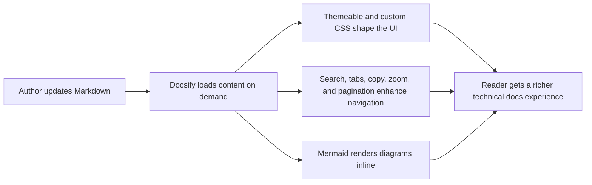

<!-- AGENTS SUMMARY
Reference page for the Docsify UX enhancements enabled in this documentation site.
Sessions:
- TLDR: Fast summary of the enabled Docsify enhancements.
- OVERVIEW: What was enabled globally in the docs shell.
- TABS: Example syntax for tabbed content.
- MERMAID: Example syntax for Mermaid diagrams.
-->

# Docs Experience

## Table of Contents

* [TL;DR](#tldr)
* [Overview](#overview)
* [Tabs Example](#tabs-example)
* [Mermaid Example](#mermaid-example)

---

<!-- START TLDR -->
## TL;DR

* This page shows the Docsify UX enhancements enabled for this documentation site.
* The site now supports richer themeing, dark and light mode, pagination, tabs, copy code, image zoom, and Mermaid diagrams.
* Use this page as a quick validation target when refining the docs experience.
<!-- END TLDR -->

---

<!-- START OVERVIEW -->
## Overview

The Docsify shell now includes:

* `docsify-themeable` for a more controllable visual base
* `docsify-darklight-theme` for a dark and light mode switch
* `docsify-sidebar-collapse` for a more navigable sidebar
* the official search plugin with deeper indexing and better visual treatment
* `docsify-pagination` for previous and next navigation
* `docsify-tabs` for structured comparative content
* `docsify-copy-code` for code block copy actions
* the official zoom image plugin for embedded images
* `docsify-mermaid` for technical diagrams
<!-- END OVERVIEW -->

---

<!-- START TABS -->
## Tabs Example

<!-- tabs:start -->

#### **Reader View**

* Use the sidebar to move by domain.
* Use the navbar to jump between the main documentation lanes.
* Use pagination at the bottom of a page to continue linearly.

#### **Contributor View**

* Keep Markdown human-readable first.
* Use tabs when the content has true alternatives, such as CLI vs API or local vs CI.
* Prefer Mermaid for architecture or workflow diagrams that would otherwise become noisy prose.

<!-- tabs:end -->
<!-- END TABS -->

---

<!-- START MERMAID -->
## Mermaid Example

<!-- END MERMAID -->
